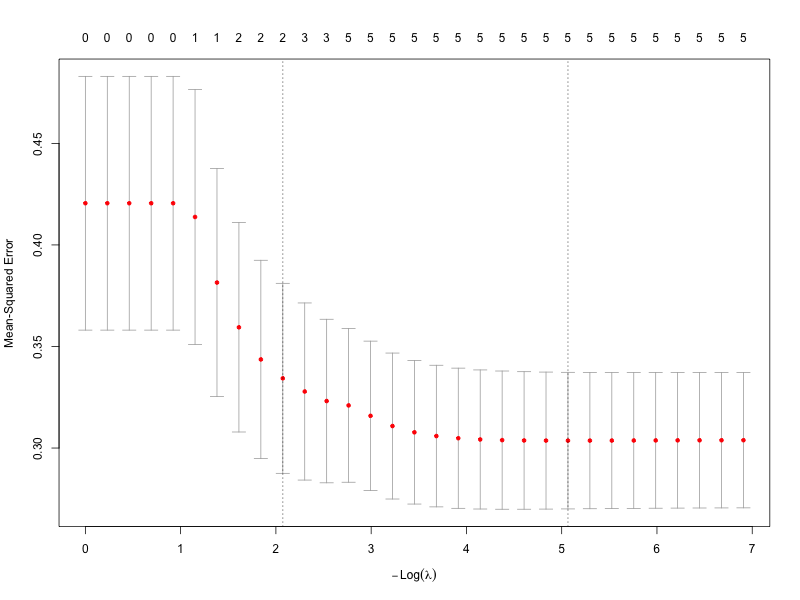

# Predicting HbA1c with Linear Regression and LASSO
**Clinical Data Analysis Case Study**

## Overview
Accurately predicting HbA1c is clinically important for identifying individuals
at risk of diabetes and metabolic disease. This project presents a clinical data
analysis case study comparing a baseline multiple linear regression model with
LASSO regression to evaluate predictive performance and model parsimony.

The analysis was completed as part of graduate-level data science training and
is presented here as an applied example of clinical predictive modeling.

---

## Data
The data were obtained from a community health screening initiative conducted
through primary-care clinics in the southeastern United States.

- Adult participants assessed during routine preventive visits
- Predictors include demographic, lifestyle, and physiological variables
  (e.g., age, BMI, physical activity, diet score)
- Two datasets were used:
  - **Training dataset:** model development
  - **Validation dataset:** external evaluation of predictive performance

---

## Methods
- Multiple linear regression with diagnostic assessment
- LASSO regression with 10-fold cross-validation
  - Model selection using **lambda.min** and **lambda.1se**
- Model evaluation using:
  - Mean squared prediction error (MSPE)
  - Residual diagnostics
  - External (out-of-sample) validation

---

## Results
- LASSO regression reduced model complexity while maintaining strong predictive
  performance.
- The **lambda.min** LASSO model achieved the lowest MSPE on both the training
  and validation datasets.
- The **lambda.1se** model provided greater parsimony but at the cost of
  reduced predictive accuracy.

### Model Performance Summary

| Model                | Train MSPE | Validation MSPE | # Predictors |
|----------------------|------------|-----------------|--------------|
| Full Linear Model    | 0.2466     | 0.1952          | 5            |
| LASSO (lambda.min)   | 0.2464     | 0.1930          | 5            |
| LASSO (lambda.1se)   | 0.2983     | 0.2245          | 2            |

---

## Interpretation
This case study highlights a common trade-off in clinical predictive modeling.
While highly parsimonious models may improve interpretability, modest increases
in model complexity can yield meaningful gains in prediction accuracy.

In clinical screening and population health contexts—where accurate
identification of individuals at risk is a primary objective—the **lambda.min**
LASSO model provides a favorable balance between accuracy and complexity.

---

## Key Figure
**LASSO Cross-Validation Curve**

---

## Reproducibility
- All analyses were conducted in **R**
- Code and results are fully reproducible using the provided R Markdown file
- The rendered analysis (`analysis.html`) is included for convenient review

---

## Files
- `analysis.Rmd` — reproducible analysis workflow  
- `analysis.html` — rendered report (no code execution required)  
- `figures/` — key visual outputs  

---

## Notes
This project was completed as part of graduate-level data science training and
is intended to demonstrate applied clinical data analysis, model selection,
and validation workflows.